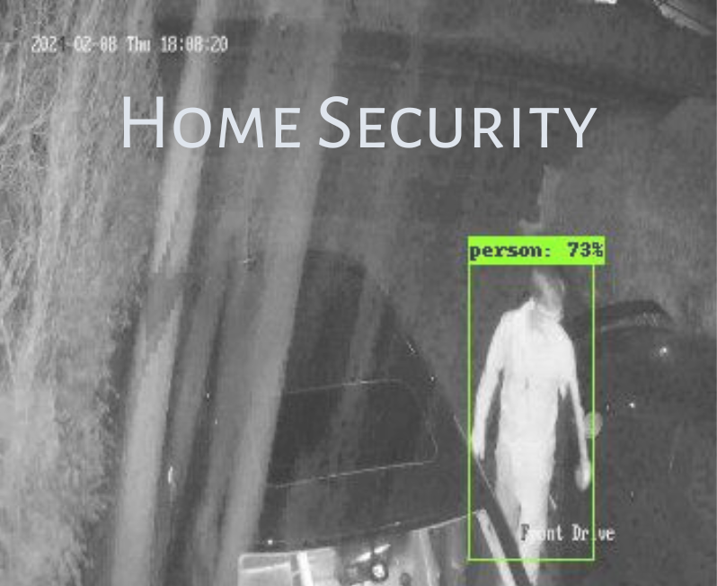

# AI Project for CCTV Home Security

## Brief
My family and grandparents homes both use the same CCTV system, which can be programmed to take photos when it detects movement within predefined zones. The key pain point here is that cats, trees and light variations cause many images to be taken. These trigger the system to send false positive intrusion email notifications to recipients.

The purpose of this project is to detect intruders in these images first. Only upon a detection does the system notify the relevant recipients of an intrusion, sharing the image of the intruder.

I made this just after I finished uni, so the code itself is not yet at my best. I will be refactoring the code and making improvements when I can find the time :)

## Tech Stack
- Python Version 3.10.12
- Tensorflow Object Detection API

## Roadmap
- Use poetry dependency manager
- Finalise Containerisation.
- Unit PyTests.
- Github Workflows.
- Integrate Database.
- Further fine-tuning on private dataset (in progress).
- Bot functionality:
    - Home/Away modes.
    - Human-in-the-loop learning (rate detections as good/bad for easy fine-tuning dataset generation).
